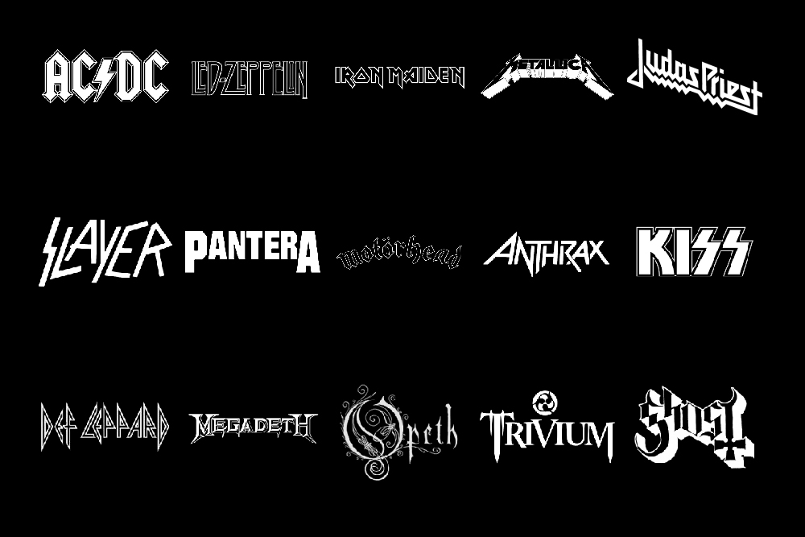
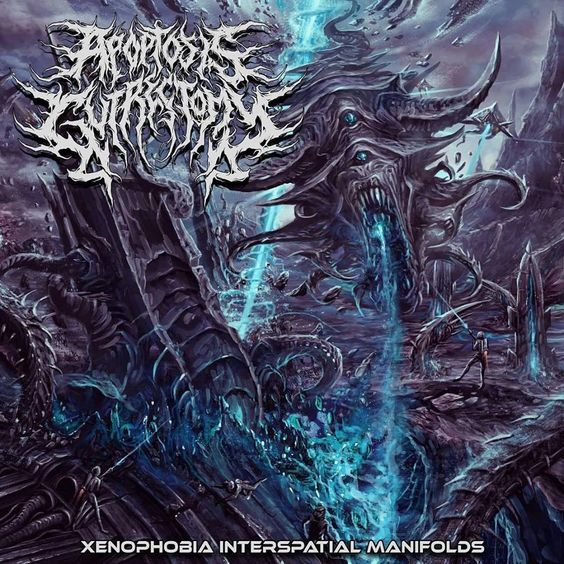

Metal music. We all know it. Some love it. Some hate it. But all can agree that, if nothing else, it is a genre of music that, over the last 50 years, has become globally recognisable both for its iconic sound and for the culture that surrounds and embodies it. 

In this multi-part series, we will look into how design and typefaces are used by different sectors of the musical world; and where better to start than with the often dark and ever intriguing metal scene.

[Rick Poynor](https://designobserver.com/feature/from-the-archive-graphic-metallica/34488) describes the visual style of heavy metal music as being 'aesthetic extremism' with designs often being as over-exaggerated and aggressive looking as possible to match the explosive nature of the music it is presenting. Traditional metal bands did not yet have the branding power accosted with the internet today so had to do as much of their advertising work within their album covers as possible, resulting in some truly iconic designs. 

The traditional metal look comes from a combination of bold aggressiveness, often utilising thick, clear lettering culminating in sharp points as well as elements of Blackletter to lend a gothic element to the design. This idea is exemplified well in the logo of Swedish metal band *Ghost* (depicted above.) Religion and religious themes are common in metal music, making this design choice one of the most effective methods of tying a visual identity to metal music. 

Connections have also been made between the fonts used by metal bands and the traditional Germanic fonts used by the Nazi party during their reign of power, predominantly due to the fact that the type now has connotations of evil and violence. This style is most apparent in the iconography of bands like *Kiss, Slayer* and *Black Sabbath.* 

Another well-known visual style found within the metal scene is the often dramatic and grotesque art that accompanies the sub-genre known as death metal. Polish artist Zdzisław Beksiński (sometimes coined 'The Nightmare Artist') is often credited with inspiring the visual identity of death metal though his art, described by himself as 'dystopian surrealism.' 

This idea often carries over into the artwork and typography of death metal albums, often using typefaces so aggressive and abstract that they become intentionally near-illegible, reflecting the extremity of the music even within an already aggressive parent genre. 

